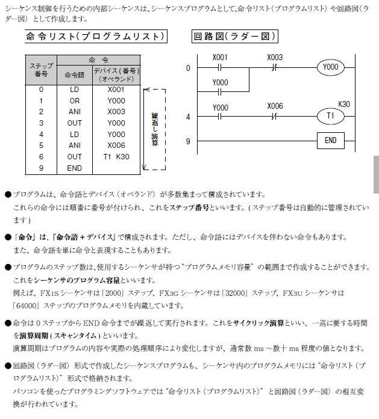

# TinySeqを作ろうと思った理由。

本文書は、私がTinySeqを作ろうと思った契機や、FORTHを使おうと思った理由を記述します。

## シーケンサが必要になった

仕事でシーケンサが欲しくなった。ないならないでなんとかするのだが、開発中の制御装置がデジタルIN数本/OUT数本でコントロールされ、
その対抗が製品搭載のPLCなので、自分の職場内でシステムが間欠しないのが不満だった。また、製品とは独立でその制御装置をエージングしたい場合に、
制御装置を駆動する方法がなくて困っていた。ならば、その制御装置専用のコントローラをマイクロコントローラで作ればよかろう。

## シーケンサを勉強した

三菱電機はシーケンサ大手である。三菱電機が発行している入門文書[初めてのシーケンサ(入門編)](https://www.mitsubishielectric.com/fa/assist/satellite/data/jy997d41501e.pdf)を見た。リレーとスイッチで構成する回路をコントローラ(というマイコンシステム)内に実現・動作させていること、その回路を「ラダープログラム」として記述しコントローラに突っ込むことが分かった。

さらに、ラダープログラムはシーケンス命令の並びにより表現できることもわかった。



シーケンス命令を見ると、
```
LD  X001
OR  Y000
ANI X003
OUT Y000
LD  Y000
ANI X006
OUT T1 K30
END
```
という風に、「これアセンブリ言語じゃないか」と思わせる表現と、これを一定時間ごとに繰り返し実行していることが分かった。これならマイクロコントローラを使って実現することはできそうだ。

ただ、テキストベースで書かれたラダープログラムを解釈し実行可能とする仕掛けが必要だった。回路図を変更するたびにファームをビルドし直してダウンロードというのは少し耐えられない。TeraTermでラダープログラムを流し込んで実行可能という形にしたい。何らかの言語実行系が必要と考えた。

## FORTHはどうだろう?

1983年に8080上で実現したFORTHシステムの記事を読んだことがある。あと、PostScriptはFORTHベースであることも聞いていたし、PostScriptプログラムも言語仕様書とCookbookを手に入れ使い倒したこともある。それでなんとなくFORTHのことは知っていた。スタック操作ベースとかはどうでもよくて、

* 命令(ワードと呼ぶ)を定義して増やしてゆくことができること、
* 実行系は辞書(名前からコード列を検索できる表)とスタック2本で実現でき単純であること、
* 実行時には(毎回名前を検索せずに、検索結果の)コード列を直接指した状態で実行するので高速実行できる

ことを覚えていた。これなら今のマイクロコントローラ上で動作するのではないかと考えた。

ネットを探してFORTHの実行処理系や、FORTHを自作しました記事を見つけた。期待通り、数十kB程度でできそうだった。

オレオレ実装が多いことも分かった。Fig-FORTH, FORTH-83, eForthなど

FORTH処理系は、最後は機械語を直接実行するものがある。それではマイクロプロセッサに依存してしまう。機械語で記述するプリミティブもそれほど多くなさそう(30～40個ぐらいから)なので、プリミティブを全てC言語で記述した/機械語非依存の処理系を探した。現代のマイクロコントローラならメモリ使用効率・実行効率もそれほど低下しないだろう。ラダープログラムの制御周期も10ms程度でよいらしい。それならば実行効率で最速を追わなくても大丈夫だろうと予想した。

結局、私から見たFORTH処理系の特徴は、

* 命令(ワードと呼ぶ)を定義して増やしてゆくことができること、
* 実行系は辞書(名前からコード列を検索できる表)とスタック2本で実現でき単純であること、
* 実行時には(毎回名前を検索せずに、検索結果の)コード列を直接指した状態で実行するので高速実行できる
* 最小限必要な命令(プリミティブ)は数十個で、これだけを実行する実行系をC言語で作ってしまえば、あとはFORTH言語で記述したワードとして実現できること。
* 通常は、プリミティブをCPU固有の機械語列として実装するが、プリミティブを仮想機械語として設計し、仮想機械語を実行する仮想CPUをC言語で記述しても良いこと。
* プリミティブ処理系+辞書のバイナリイメージで一つのアプリケーションを表現できること。TinySeqもこの形で実現すればよい。

もう少し詳しい記述を[FORTH.md](FORTH.md)で説明します(予定)。

## zForth

C言語のみで記述されたFORTH処理系として[zForth](https://github.com/zevv/zForth)を見つけた。これを git clone、ビルドしてLinux上で動かしてみると数10kBの範囲に収まっている。<stdio.h>が大きいので、`printf`を自前で用意すればさらに小さくなる、32kBぐらいまで収まるだろう。ソースコードをざっと見て雰囲気を掴んだ。これなら理解の範囲だ。メモリ操作のみでI/O部分が少ない(putchar/getcharのみ)なので、これならC89/90しかない世界でも十分ビルドできるだろう。シリアルI/OからのReed/Writeを作成すれば、あとはRAM状に配列(数キロバイト程度)一つとスタック(数十個レベル)を2個用意すればよい。辞書も数kB～10kB以下として、RAMが8kB～16kBあれば出来そう。ATmega328Pではしんどそうだな。

自前の`printf`として、Chanさんの[`xprintf`](http://elm-chan.org/fsw/strf/xprintf_j.html)を使うことにした。これに入れ替えてビルドするとだいぶ小さくなった。

## zForthをマイクロコントローラ上で動かす。

PIC32MX250F128, Raspberry Pi Pico上でビルドしてみる。シリアル1バイト入出力関数だけ書いてつなぐ。わりと簡単にビルド・実行できるようになった。

## I/O Expanderを使う

このシーケンサのつなぐ先は、IN12本, OUT8本を持つコントローラで、それとは別にスイッチ6個、LED 3個を制御する必要があった。よって、シーケンサのスイッチは、X000 ～ X017 の18個、出力は Y000 ～ Y010 の9個、合計27本のGPIO端子が必要になる。これだと普通の28ピン、40ピンのDIPパッケージのマイクロコントローラではI/O端子数が足りない。とりあえず、MCP23017を導入してIN8, OUT8をそちらに逃がすことでなんとか28ピンのPIC32MXでも対応できるめどがついた。

TQFP64ピンパッケージなら I/O Expanderなしでも十分カバーできると考えているが、まず最初のターゲットを28Pin DIP PIC32MX + MCP23017で進めることにした。それに応じて I2C を使えるようにして、MPC23017 制御用の関数群を揃えた。

## I2C EEPROMを使う。

シーケンサ用のFORTHプログラムをダウンロードせずに基板上に搭載しておくために、CPUとは別にEEPORMを使うことにした。I/O Expanderで既にI2Cを使っているので、EEPROMもI2C接続のものを使用する。辞書サイズは数kB程度と相的出来たので、秋月で適当な容量のものを見繕った。

## ラダープログラムをFORTH上で表現する

ラダープログラムを記述する際に、シーケンス命令で記述するよりも、ラダー図を
そのまま食わせられた方がよいと考えた。半分ぐらいは私の好みの問題として。ラダー図をASCII ARTとして、例えば、

```
|- X001 ---+---- /X003 ---- ( Y000 ) -|
|- Y000 ---|
|- Y000 -------- /X006 ---- (T1 K30) -|
|---------------------------[ END ]---|
```
という風に書けると楽しそうじゃないか。

FORTHは空白文字以外の文字の列をワードとして、ワード単位で解釈実行する。ならば、上図の `|-`, `X001`, `---+----`, `/X003`, `(`, `Y000`, `)`, ... をFORTHのワードとして実現すればよいという気がした。

実際にはうまくいかないところがある。それは、2本線が1本にマージされるところ
```
---+---
---|
```
で、2行目の `-|`を見つけて初めて1行目の`---+---`とOR結合させるように解釈せねばならない。FORTH言語の解釈方法は逐次的である。このような表現は、大域的に解釈・構文木を構成して解釈というやり方を取らないFORTH言語とは相性が悪い。

しばらく考えて、そこはプログラマに管理してもらうことにしようとした。すなわち、マージ点すべてに共通の番号を付けて、共通の番号のマージ点に入る線の値をOR結合することにした。この場合、上記の例は、
```
---|1
---+1---
```
と書く。右側の引き出し線を2行目に移すことで、それ以後の結線を逐次的解釈の範囲で解釈することができる。実装上は、結線番号ごとに値を保持する変数を一つつ作り、サイクル開始時に0とし、入り線が現れるたびにその変数にORしてゆくようにした。どれか一つの入り線で1(ON)になっていればその結線の値はONとなるからである。

`(Y000)`, `(T1 K30)`についてもカッコを使わない形式に改めた。FORTH言語では、`( ... )`はコメントを表す。ここを変更する手もあるが、カッコで囲まなくても逆ポーランド記法で書けばまとまりとして処理できるし、この程度ならFORTH慣れしていない(私を含む)人々でも対応できると信じて、`Y000`や、`T1 K30`とカッコ無しで書くようにする。

異なる意味を持つワードは異なる表現としておきたいので、スイッチには .a, .bを追加し、`X000.a`, `M000.b`のように表現し、リレーコイルはそのまま `Y000`, `M000`のように表現することとした。

以上をまとめると、今回のTinySeqラダー言語は、
```
|- X001.a -|1
|- Y000.a -+1- X003.b --- Y000   -|
|- Y000.a ---  X006.b --- T1 K30 -|
```
と表現されることになる。ここまで考えて、だいたいイケそうという感触を掴んだ気がした。

## サイクリック演算

ラダープログラムは周期的に実行される。通常のFORTH言語の範囲に周期的な実行の概念はないので、あるワードを定義しておけば、そのワードを周期的に実行するようにFORTHインタプリタを改造する。タイマ割込み処理関数の中で、FORTHインタプリタのeval関数を呼び出すイメージの実装になる。TinySeqでは、当然のごとくワード`ladder`を採用した。

ラダープログラム全体をコロン定義で一つのワードに定義する。
```
: ladder 
  .... (ラダープログラム)
;
```
というプログラム(コロン定義)を起動直後にFORTHインタプリタに読み込ませる。

